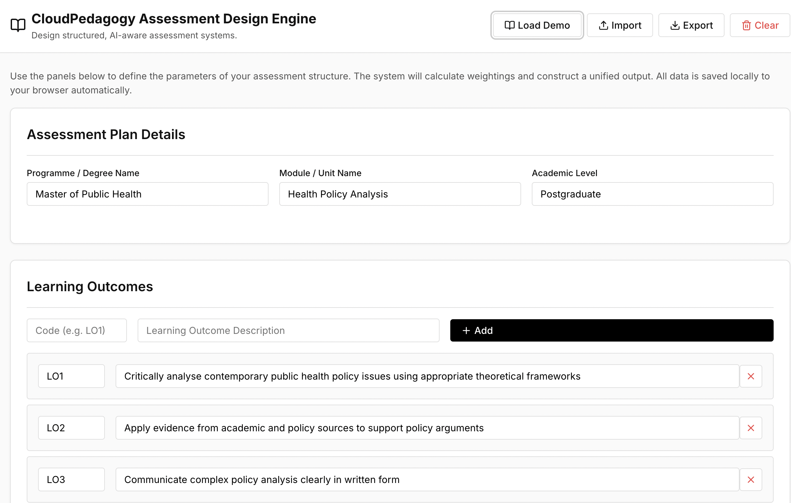

# Assessment Design Engine

A local-first tool for designing structured, AI-aware assessment systems aligned to learning outcomes.

🌐 **Live Hosted Version**  
http://cloudpedagogy-assessment-design-engine.s3-website.eu-west-2.amazonaws.com/

🖼️ **Screenshot**  

---

## 🔗 Role in the CloudPedagogy Ecosystem

**Phase:** Phase 4 — Assessment & Integrity Layer  

**Role:**  
Supports the design of structured assessment systems aligned to learning outcomes, with explicit consideration of AI use and authenticity.

**Upstream Inputs:**  
- Curriculum structures from the Mapping Engine  
- Programme design context from Governance Dashboard  

**Downstream Outputs:**  
- Inputs for the AI Integrity Design Tool  
- Structured outputs for the Evidence & QA Pack Generator  

**Does NOT:**  
- Deliver teaching or grading  
- Enforce academic integrity  
- Replace institutional assessment policies  

---

## Overview

The **Assessment Design Engine** enables educators and programme teams to design coherent, transparent, and AI-aware assessment systems.

It supports:
- alignment between learning outcomes and assessment tasks  
- structured definition of assessment types and weightings  
- explicit consideration of AI use  
- clearer articulation of authenticity and expectations  

This helps ensure assessment remains valid, meaningful, and defensible in an AI-enabled environment.

---

## Key Features

- **Learning Outcome Mapping**  
  Link assessments directly to intended learning outcomes  

- **Assessment Structuring**  
  Define assessment types, descriptions, and weightings  

- **AI-Aware Design**  
  Consider where and how AI may be used  

- **Authenticity Considerations**  
  Support design of meaningful and defensible tasks  

---

## Additional Documentation

- [User Instructions](./INSTRUCTIONS.md)
- [Project Specification](./PROJECT_SPEC.md)

---

## Technical Overview

- Built with TypeScript + Vite (React)  
- Fully local-first — runs entirely in the browser  
- Uses localStorage for persistence  
- Supports JSON import/export  
- No backend or external data storage  

---

## Run Locally

npm install  
npm run dev  

---

## Build

npm run build  

---

## Design Principles

- Local-first and inspectable  
- Governance-aware by design  
- Structured, not automated decision-making  
- Supports human judgement rather than replacing it  

---

## Disclaimer

This repository contains exploratory, framework-aligned tools developed for reflection, learning, and discussion.

These tools are provided as-is and are not production systems, audits, or compliance instruments. Outputs are indicative only and should be interpreted using professional judgement.

- All applications run locally in the browser  
- No user data is collected, stored, or transmitted  
- All example data is synthetic and does not represent real institutions or programmes  

---

## About CloudPedagogy

CloudPedagogy develops open, governance-credible tools for building confident, responsible AI capability across education, research, and public service.

- Website: https://www.cloudpedagogy.com/  
- Framework: https://github.com/cloudpedagogy/cloudpedagogy-ai-capability-framework  
